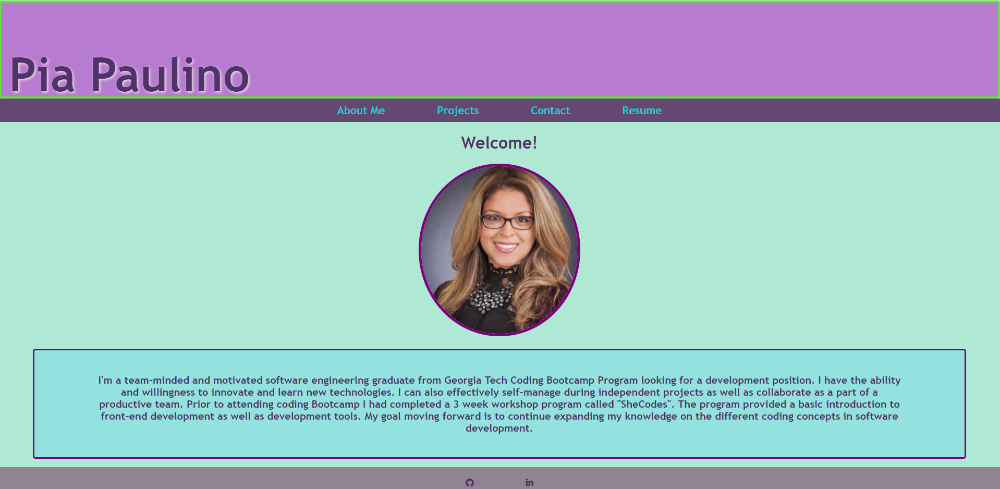

# React Portfolio:

## Objective:

Create a portfolio using my new React skills and sucessfully deploy it to my GitHub pages. 

## Details:

* Portfolio contains a header with my full name and a navigation to an 'About ME' section, a 'Projects' section, a 'Contat' section and a 'Resume' section. Also a footer is available with icon links to my GitHub and my LinkedIn account.  

* When Clicked on the navigation section the corresponding section appears without the page reloding.

* When the portfolio is loaded up the 'About Me' section is selected by default.

* When navigating to the 'About Me' section it has a photo of me a short bio about me. 

* When navigating to the 'Projects' section it displays 6 images of my recent projects along with links to their corresponding GitHub repository.

* When navigatin to the 'Contact' section there's an input field for a name, an email address and a message. 

* When navigating to the 'Resume' section there's a a link to a downloadable resume and a list of my proficiencies.

___

## DEMO:

<!-- [My GitHub Repo](https://github.com/Maripia12/React-portfolio/tree/main) -->

<!-- [Link to Deployed React Portfolio](https://maripia12.github.io/React-portfolio/) -->

